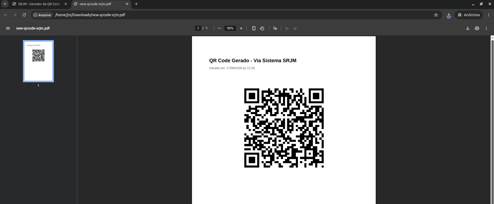

# Gerador de QR Code - SRJM


Sistema web para geração de QR Codes a partir de URLs ou textos, com opção de download nos formatos PNG, JPEG e PDF.



## Tecnologias

- Node.js
- HTML, CSS e JavaScript
- Docker

## Makefile 

### Build da imagem e push

```bash
make
```

### Executar

```bash
docker run -d -p 3000:3000 srjm2024/gerador-qrcode-srjm:latest
```

Acesse:

```text
http://localhost:3000
```


## Autor

João Marcelo Silva Beserra